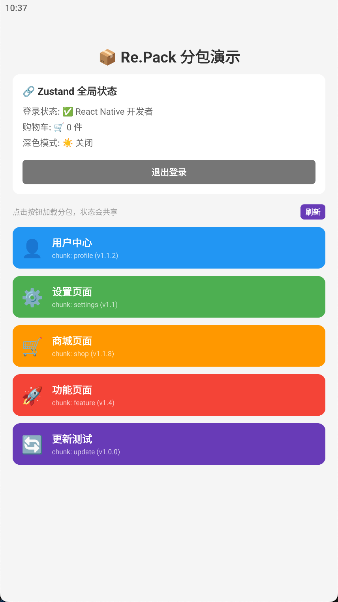

# TabletOrdering - React Native 代码分割实践

基于 React Native 0.83 + Re.Pack 的模块化分包示例项目，演示如何实现远程代码加载和动态更新。



## 技术栈

| 技术 | 用途 |
|------|------|
| React Native 0.83.0 | 跨平台移动开发框架 |
| TypeScript 5.0 | 类型安全 |
| @callstack/repack 5.2.3 | 代码分割与远程加载 |
| Zustand | 轻量级状态管理 |

## 架构概览

```
┌─────────────────────────────────────────────────────┐
│                      App.tsx                        │
│  ┌─────────────┐    ┌─────────────────────────────┐ │
│  │  HomeScreen │───▶│ ChunkErrorBoundary          │ │
│  └─────────────┘    │ ┌─────────────────────────┐ │ │
│                     │ │ Suspense → Screen       │ │ │
│                     │ │ (动态加载的分包)         │ │ │
│                     │ └─────────────────────────┘ │ │
│                     └─────────────────────────────┘ │
└─────────────────────────────────────────────────────┘
                              │
                              ▼
                    ┌─────────────────┐
                    │ ScriptManager   │
                    │ (Re.Pack)       │
                    └────────┬────────┘
                             │
              ┌──────────────┴──────────────┐
              ▼                             ▼
        ┌──────────┐                 ┌──────────┐
        │ DevServer│                 │ 远程服务器│
        │ (开发环境)│                 │ (生产环境)│
        └──────────┘                 └──────────┘
```

## 分包结构

| 分包名称 | 加载路径 | 功能 |
|----------|----------|------|
| feature | `src/screens/FeatureScreen.tsx` | 功能演示页 |
| settings | `src/screens/SettingsScreen.tsx` | 设置页 |
| profile | `src/screens/ProfileScreen.tsx` | 个人页 |
| shop | `src/screens/ShopScreen.tsx` | 商城页（带购物车状态共享） |
| update | `src/screens/UpdateTestScreen.tsx` | 更新测试页 |

## 核心实现

### 1. 入口配置 (index.js)

```javascript
// 配置 ScriptManager 的 Resolver
ScriptManager.shared.addResolver(async scriptId => {
  const config = remoteBundleConfig[scriptId];
  const url = typeof config === 'string' ? config : config.url;
  const latestVersion = typeof config === 'string' ? null : config.version;

  // 版本号作为 URL 参数，触发 Re.Pack 缓存更新
  const versionedUrl = latestVersion ? `${url}?v=${latestVersion}` : url;

  return { url: versionedUrl, cache: true };
});
```

### 2. 版本检查与更新

```typescript
// index.js - 版本检查逻辑
const isUpdateAvailable = cachedVersion && cachedVersion !== latestVersion;

if (isUpdateAvailable) {
  // 通知 UI 显示更新对话框
  onVersionCheckCallback({
    screen: scriptId,
    currentVersion: cachedVersion,
    latestVersion: latestVersion,
    isUpdateAvailable: true,
  });
}
```

### 3. 更新弹窗组件

```typescript
// UpdateDialog.tsx
interface UpdateDialogProps {
  onUpdate: () => void;   // 用户确认更新
  onCancel: () => void;   // 用户取消
}

// 点击更新后执行：
// 1. 清除模块缓存 ScriptManager.shared.invalidateScripts([screen])
// 2. 记录已确认版本 confirmBundleUpdate(screen, version)
// 3. 强制重新加载（更新 loadTimestamps + retryKey）
```

### 4. 状态共享

所有分包共享 Zustand store：

```typescript
// useAppStore.ts
interface AppState {
  cartCount: number;
  addToCart: () => void;
  clearCart: () => void;
  pendingUpdate: ModuleUpdateInfo | null;
  setPendingUpdate: (update: ModuleUpdateInfo | null) => void;
}
```

## 快速开始

```bash
# 安装依赖
npm install

# 启动开发服务器
npm start

# 运行 iOS
npm run ios

# 运行 Android
npm run android
```

## 构建分包

```bash
# 构建 Android 分包（用于远程加载）
npm run bundle:android:chunk

# 构建 iOS 分包
npm run bundle:ios

# 构建主包（Release）
npm run bundle:android
```

## 远程部署

1. 执行 `npm run bundle:android:chunk` 生成分包文件
2. 上传 `build/outputs/bundle/release/android/index.android.bundle` 到服务器
3. 配置 API 返回分包版本信息

### 服务器配置示例

```json
{
  "shop": {
    "url": "https://your-server.com/shop.chunk.bundle",
    "version": "1.1.0"
  },
  "feature": {
    "url": "https://your-server.com/feature.chunk.bundle",
    "version": "1.0.0"
  }
}
```

## 版本更新流程

```
┌─────────────┐     ┌─────────────┐     ┌─────────────┐
│ 用户进入分包 │────▶│ 检查版本差异 │────▶│ 发现新版本  │
└─────────────┘     └─────────────┘     └──────┬──────┘
                                               │
                    ┌──────────────────────────┘
                    ▼
            ┌─────────────┐         ┌─────────────┐
            │ 显示更新弹窗 │────────▶│ 点击"更新"  │
            └─────────────┘         └──────┬──────┘
                                           │
                    ┌──────────────────────┴──────────────┐
                    ▼                                     ▼
            ┌─────────────┐                       ┌─────────────┐
            │ 清除模块缓存 │                       │ 点击"取消"  │
            └──────┬──────┘                       └─────────────┘
                   │
                   ▼
            ┌─────────────┐
            │ 重新加载分包 │
            └─────────────┘
```

## 目录结构

```
TabletOrdering/
├── index.js                    # 入口文件，Re.Pack 配置
├── App.tsx                     # 主应用，路由与动画
├── src/
│   ├── components/
│   │   ├── BackButton.tsx      # 返回按钮
│   │   ├── ChunkErrorBoundary.tsx  # 分包加载错误边界
│   │   └── UpdateDialog.tsx    # 更新提示弹窗
│   ├── screens/
│   │   ├── HomeScreen.tsx      # 首页
│   │   ├── FeatureScreen.tsx   # 功能分包
│   │   ├── SettingsScreen.tsx  # 设置分包
│   │   ├── ProfileScreen.tsx   # 个人分包
│   │   ├── ShopScreen.tsx      # 商城分包
│   │   └── UpdateTestScreen.tsx # 更新测试页
│   └── store/
│       └── useAppStore.ts      # Zustand 状态管理
└── package.json
```

## 常见问题

### Q: 开发环境正常，生产环境分包加载失败？

检查清单：
1. 分包是否上传到服务器
2. 服务器 URL 配置是否正确
3. 版本号是否已更新
4. 网络权限是否配置

### Q: 点击更新后没有重新加载？

确保：
1. 调用了 `ScriptManager.shared.invalidateScripts([screen])`
2. 更新了 `loadTimestamps` 或 `retryKey` 触发组件重新渲染

### Q: 如何测试版本更新？

1. 在商城页面添加/修改内容
2. 升级版本号
3. 重新构建分包并上传
4. 在 App 中进入商城，点击刷新
5. 观察更新弹窗，点击更新

## License

MIT
